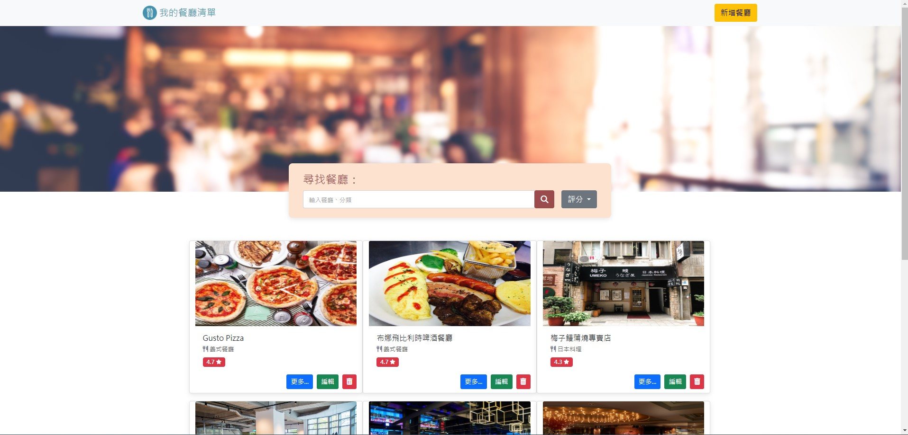

# 我的餐廳清單
## Login page about Restaurant List

## Index page about Restaurant List


## 介紹
這是一個用Node.js+Express所做得餐廳清單
使用者可以創建帳號並登入(包含本地及 Facebook 登入)，讓每名使用者可以管理自己專屬的餐廳清單。
在餐廳列表中可以增加自己喜愛的餐廳清單、瀏覽餐廳、查看詳細資訊、排序、及連結到google地圖。

### 功能
- 使用者可登入、註冊帳號
- 使用者可以使用Facebook登入
- 瀏覽所有餐廳
- 瀏覽餐廳的詳細資訊
- 連結餐廳的地址到 Google 地圖
- 搜尋特定餐廳
- 新增餐廳
- 編輯餐廳
- 刪除餐廳
- 排序餐廳


## 開始使用
1. 請先確認已安裝 Node.js 與 npm。
2. 將專案 clone 到本地。
3. 在本地開啟專案，進入資料夾後，在終端機輸入以下指令：
```bash
   npm install
   ```
4. 根據env.example範例 建立.env檔案 須包含:
   ```bash
   FACEBOOK_ID=<YOUR FACEBOOK-ID>
   FACEBOOK_SECRET=<YOUR FACEBOOK-SECRET>
   FACEBOOK_CALLBACK=http://localhost:3000/auth/facebook/callback
   MONGODB_URI= <YOUR MONGODB-URI>
   SESSION_SECRET=my-secret-key
   PORT=3000
   ```
5. 建立種子資料，請輸入以下指令:
   ```bash
   npm run seed
   ```
   將會得到2組試用帳號:
   ||Name|Email|Password|
    |:--|:--:|:--:|:--:|
    |1|user1|user1@example.com|12345678|
    |2|user2|user2@example.com|12345678|

4. 啟動伺服器，執行 app.js 檔案
```bash
   npm run dev
   ```
5. 當終端出現以下字樣，表示伺服器與資料庫已啟動並成功連結[http://localhost:3000/](http://localhost:3000/)
```bash
   Express is running now
   ```
6. 若欲暫停伺服器
 ```bash
   ctrl + c
   ```

## 開發工具
- bcryptjs: 2.4.3,
- body-parser: 1.20.2,
- connect-flash: 0.1.1,
- express: 4.18.2,
- express-handlebars: 5.3.3,
- express-session: 1.17.1,
- font-awesome: 4.7.0,
- method-override: 3.0.0,
- mongodb: 5.6.0,
- mongoose: 5.9.7,
- nodemon: 2.0.22,
- passport: 0.4.1,
- passport-facebook: 3.0.0,
- passport-local: 1.0.0


### 開發人員
[Harrison](https://github.com/Harrison0502)
